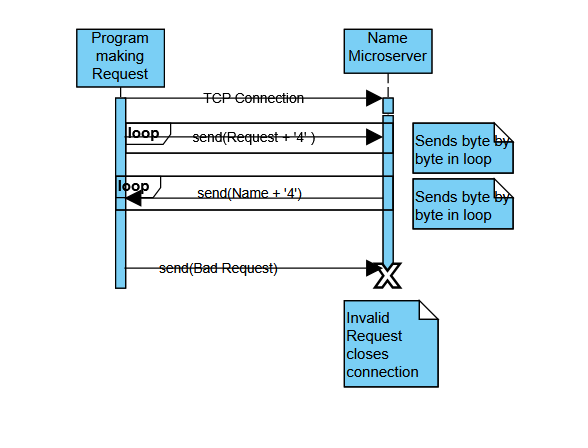

# CS-361-Name-Generator
Microservice for the Winter 2026 Ecampus CS361 group project assignment.

### Overview
The microservice generates a name based on 
the user's request of a theme and a first and/or 
last name. Avaliable themes include modern, sci-fi,
and fantasy. The name choice is random and
the service includes 200 first names
and 200 last names for each theme.

### Requests
To request data from the microservice, define the specfic 
request as a string type, get the size of the request in bytes,
finally send each byte until the whole request has been sent.

The request is formatted as ```<theme>:<first_name>:<last_name>```
- ```theme``` Is the theme of name desired, written as a string. Currently ```fantasy```, ```sci-fi```, and ```modern``` are the only options implemented.
- ```first_name``` Indicates whether or not a first name is desired as part of the response. This field should either be ```true``` or ```false```.
- ```last_name``` Indicates whether or not a last name is desired as part of the response. This field should either be ```true``` or ```false```.

One or both of ```first_name``` and ```last_name``` must be ```true```, or else the microservice will not respond to the request.

For example, using a send_request fuction as shown below takes 
in a socket number and a message and interatively sends the
request:
```c++
int request_result = send_request(socket, message);

int send_request(int socket, std::string request){
    char eot = 4;
    request += eot;
    int total_bytes_sent = 0;
    int bytes_to_send = request.length();
    int bytes_remaining = bytes_to_send;
    char* request_ptr = &(request[0]);
    while(total_bytes_sent < bytes_to_send){
        int bytes_sent = send(
            socket, 
            request_ptr + total_bytes_sent,
            bytes_remaining,
            0
        );
        if(bytes_sent != -1){
            total_bytes_sent += bytes_sent;
            bytes_remaining -= bytes_sent;
        }else{
            //Some error occured. Print an error message
            std::cout << " Error on sending request\n" << std::endl;
            return -1;
        }
    }
    return 0;
}
```

### Responses
To receive data, you define a message buffer, and while 
the end of the transmission has not come, check that 
there is enough space in the message buffer (resizing the buffer
when needed) and get data from the client using recv(). 

The response is simply formatted as ```<first_name> <last_name>```.

Each field will only be filled if it was marked as ```true``` in the original request

For example, using a get_response function:
```c++
int response_result = get_response(socket, response);

int get_response(int socket, std::string &response){
    int initial_size = 100;
    char* message = (char*) malloc(sizeof(char) * initial_size);
    int total_bytes_received = 0;
    int max_bytes_remaining = initial_size;
    denote the end
    char end_of_transmission[2] = {4, '\0'};
    while(strstr(message, end_of_transmission) == nullptr){
        if(max_bytes_remaining <= 0){
            //Resize the buffer to handle more text
            max_bytes_remaining += initial_size;
            initial_size *= 2;
            message = (char *) realloc(message, initial_size);
        }
        int bytes_received = recv(
            socket,
            message + total_bytes_received,
            max_bytes_remaining,
            MSG_PEEK
        );
        if(bytes_received > 0){
            //Server sent data, record how much was received
            total_bytes_received += bytes_received;
            max_bytes_remaining -= bytes_received;
        }else if(bytes_received == 0){
            //Server sent no data
            return -1;
        }else{
            //recv had an error
            std::cout << "Error receiving data from server, recv returned " << bytes_received << std::endl;
            return -1;
        }
    }
    char* transmission_end = strstr(message, end_of_transmission);
    transmission_end[0] = '\0';
    response = message;
    free(message);
    return 0;
}
```
### UML Diagram
 
